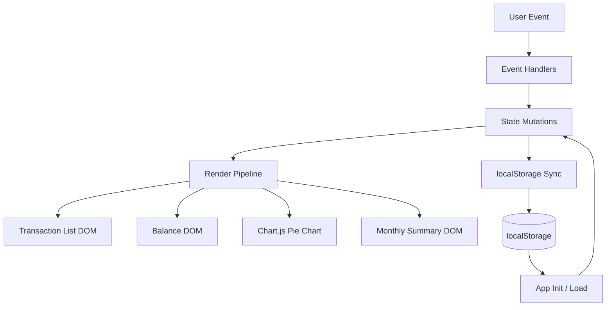

# Design Document: Expense & Budget Visualizer

## Overview

The Expense & Budget Visualizer is a fully client-side single-page web application (SPA) built with HTML, CSS, and Vanilla JavaScript. It has no build step, no backend, and no external dependencies beyond a CDN-hosted Chart.js. All application state is persisted in `localStorage`.

The design follows a **module pattern** inside a single JavaScript file: logically distinct responsibilities (storage, state management, rendering, event handling, chart management) are separated into clearly named function groups. A central `AppState` object is the single source of truth; all UI updates are derived from it.

---

## Architecture



### Data Flow

1. User triggers an event (form submit, delete click, sort change, theme toggle, view switch).
2. An event handler validates and transforms the input into a state mutation.
3. The mutation updates `AppState` and synchronizes it to `localStorage`.
4. The render pipeline reads `AppState` and updates all affected DOM regions.

This one-way data flow keeps the UI predictable and eliminates synchronization bugs between DOM and stored data.

---

## Components and Interfaces

### AppState (Singleton Object)

```js
AppState = {
  transactions: Transaction[],   // all transactions, in insertion order
  theme: 'light' | 'dark',
  sort: SortOption | null,       // active sort; null = insertion order
  view: 'main' | 'monthly'       // active view
}
```

### Transaction Data Shape

```js
Transaction = {
  id: string,           // crypto.randomUUID() or Date.now().toString()
  name: string,         // item name (non-empty)
  amount: number,       // positive number
  category: 'Food' | 'Transport' | 'Fun',
  date: string          // ISO 8601 date string (YYYY-MM-DD) of creation date
}
```

### SortOption

```js
SortOption = 'amount-asc' | 'amount-desc' | 'category-asc'
```

### Storage Module (`storage.js` logic inside `app.js`)

| Function | Signature | Description |
|---|---|---|
| `loadState()` | `() => AppState` | Reads and parses localStorage; returns default state on error |
| `saveTransactions(transactions)` | `(Transaction[]) => void` | Serializes and writes transactions to localStorage |
| `saveTheme(theme)` | `(string) => void` | Writes theme string to localStorage |
| `saveSort(sort)` | `(SortOption\|null) => void` | Writes active sort to localStorage |

### Render Module

| Function | Description |
|---|---|
| `renderAll()` | Calls all render sub-functions; used after any state change |
| `renderTransactionList()` | Renders sorted/filtered transaction list DOM |
| `renderBalance()` | Recalculates and displays total balance |
| `renderChart()` | Computes category totals and updates Chart.js dataset |
| `renderMonthlySummary()` | Groups transactions by month and renders summary view |

### Validation Module

| Function | Signature | Returns |
|---|---|---|
| `validateForm(name, amount, category)` | `(string, string, string) => ValidationResult` | `{ valid: boolean, errors: string[] }` |

### Chart Module

| Function | Description |
|---|---|
| `initChart(ctx)` | Creates Chart.js pie chart instance, stores reference |
| `updateChart(categoryTotals)` | Updates chart data and calls `chart.update()` |

---

## Data Models

### Transaction (canonical shape)

```js
{
  id: "1721234567890",
  name: "Lunch",
  amount: 12.50,
  category: "Food",
  date: "2025-07-17"
}
```

### localStorage Keys

| Key | Type | Description |
|---|---|---|
| `ebv_transactions` | `string` (JSON array) | Serialized array of Transaction objects |
| `ebv_theme` | `'light'` \| `'dark'` | Persisted theme preference |
| `ebv_sort` | `string` \| `null` | Persisted sort option |

### Category Totals (computed, not stored)

```js
categoryTotals = {
  Food: number,
  Transport: number,
  Fun: number
}
```

Computed by `transactions.reduce(...)` each time the chart or monthly summary is rendered.

### Monthly Group (computed, not stored)

```js
MonthlyGroup = {
  label: string,          // e.g. "July 2025"
  yearMonth: string,      // e.g. "2025-07"
  transactions: Transaction[],
  total: number,
  categoryTotals: { Food: number, Transport: number, Fun: number }
}
```

---

## Correctness Properties

*A property is a characteristic or behavior that should hold true across all valid executions of a system — essentially, a formal statement about what the system should do. Properties serve as the bridge between human-readable specifications and machine-verifiable correctness guarantees.*

### Property 1: Valid transaction addition grows list

*For any* valid transaction (non-empty name, positive amount, valid category), adding it to the app state should result in the transaction list length increasing by exactly 1.

**Validates: Requirements 1.2**

---

### Property 2: Invalid form input is rejected

*For any* form submission where at least one required field is empty, whitespace-only, or the amount is non-numeric/zero/negative, the transaction list should remain unchanged.

**Validates: Requirements 1.3, 1.4**

---

### Property 3: Input form clears after successful add

*For any* successful transaction submission, the form fields (name, amount, category) should each return to their default/empty state.

**Validates: Requirements 1.5**

---

### Property 4: Transaction list renders all fields

*For any* collection of transactions, each transaction's item name, amount, and category should appear in the rendered transaction list HTML.

**Validates: Requirements 2.1**

---

### Property 5: Delete removes transaction from list and storage

*For any* transaction that exists in the app state, deleting it should result in the transaction no longer appearing in the rendered list and no longer being present in `localStorage`.

**Validates: Requirements 2.3**

---

### Property 6: Balance equals sum of all amounts

*For any* collection of transactions (including the empty collection), the displayed balance should equal the arithmetic sum of all transaction amounts. For an empty collection the balance is 0.

**Validates: Requirements 3.1, 3.2, 3.3, 3.4**

---

### Property 7: Chart data category totals match transaction sums

*For any* collection of transactions, the computed chart data for each category should equal the sum of amounts of all transactions belonging to that category.

**Validates: Requirements 4.1, 4.3**

---

### Property 8: Storage round-trip preserves transactions

*For any* collection of transactions written to `localStorage`, reading and deserializing that data should produce a collection equal to the original (same ids, names, amounts, categories, and dates).

**Validates: Requirements 5.1, 5.2, 5.3**

---

### Property 9: Theme toggle produces opposite theme

*For any* current theme value, activating the toggle should result in the opposite theme being applied and persisted to `localStorage`.

**Validates: Requirements 6.2, 6.3, 6.4**

---

### Property 10: Sorting is a non-mutating permutation

*For any* collection of transactions and any valid sort option, the sorted display should contain exactly the same transactions as the unsorted collection — same ids, same data, just reordered — and the underlying `localStorage` data should remain in insertion order.

**Validates: Requirements 7.2, 7.3, 7.4**

---

### Property 11: Monthly grouping assigns transactions to correct month

*For any* collection of transactions, each transaction should appear in exactly one monthly group corresponding to the year-month of its `date` field. The monthly group's total should equal the sum of its transaction amounts, and per-category totals should equal category sums within the group.

**Validates: Requirements 8.1, 8.2, 8.4**

---

## Error Handling

| Error Scenario | Handling Strategy |
|---|---|
| `localStorage` unavailable (e.g., private browsing quota exceeded) | Catch exception in `loadState()` / `saveTransactions()`; initialize with empty state; display a non-blocking warning banner |
| `localStorage` returns malformed JSON | `JSON.parse` wrapped in try/catch; fall back to empty array; display warning |
| Chart.js CDN fails to load | Check `typeof Chart === 'undefined'` on init; display a text-based fallback showing category totals |
| Invalid amount input (text, negative, zero) | `validateForm` returns error; display inline error message below the Amount field; do not create transaction |
| Empty name field | `validateForm` returns error; display inline error below the Name field |
| No category selected | `validateForm` returns error; display inline error below the Category selector |
| `crypto.randomUUID` unavailable (older browsers) | Fall back to `Date.now().toString() + Math.random().toString(36)` |

---

## Testing Strategy

This project uses **Vanilla JavaScript** with no build toolchain, so tests are written as plain JavaScript assertions that run in the browser console or via a lightweight test runner script. No external test framework is required (per NFR-1).

### Testing Approach

Because the core logic (validation, state mutation, storage serialization, sorting, grouping, balance calculation, chart data computation) consists of **pure or near-pure functions**, property-based testing applies well to this feature.

**Property-Based Testing**: Use [fast-check](https://fast-check.dev/) loaded via CDN in a separate `test.html` file (not part of the production build). fast-check generates random inputs and checks that properties hold for all of them.

**Unit Tests**: For specific examples, edge cases, and integration points (Chart.js update call, DOM mutations) use plain assertion-based unit tests.

**No test framework setup is added to the production app files** — tests live only in `test.html` and a companion `test.js` file, which are excluded from the production folder.

### Property Test Configuration

- Minimum **100 iterations** per property test (fast-check default is 100; leave at default).
- Each property test is annotated with a comment referencing the design document property.
- Tag format in comments: `// Feature: expense-budget-visualizer, Property N: <property_text>`

### Test Coverage Matrix

| Property | Test Type | Key Input Generators |
|---|---|---|
| P1: Valid transaction addition grows list | Property | Random (name, positiveAmount, category) |
| P2: Invalid form input rejected | Property | Random invalid combos (empty fields, bad amounts) |
| P3: Form clears after add | Property | Random valid transactions |
| P4: List renders all fields | Property | Random transaction arrays |
| P5: Delete removes from list + storage | Property | Random transaction sets, random deletion target |
| P6: Balance equals sum | Property | Random transaction arrays (including empty) |
| P7: Chart data matches category sums | Property | Random transaction arrays |
| P8: Storage round-trip | Property | Random transaction arrays |
| P9: Theme toggle inverts theme | Property | Both theme values |
| P10: Sort is non-mutating permutation | Property | Random transactions, random sort option |
| P11: Monthly grouping correctness | Property | Random transactions with varied dates |

### Unit / Example Tests

- Empty state message when no transactions
- Balance displays 0 when no transactions
- Chart shows empty state when no transactions
- Sort control exists with correct options
- Toggle control exists in DOM
- Monthly summary updates after add/delete
- localStorage parse error → empty state + warning shown
